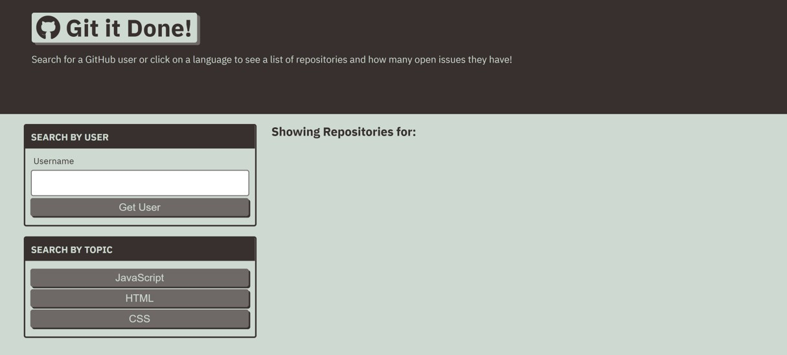

# Git-It-Done

## Description

Git-It-Done is a web app that searches GitHub for open source projects with open issues and pull requests.

The requirement was to add the necessary JavaScript logic to display GitHub repositories and their open issue counts based on a user's search.

The app runs in the browser and was built using HTML, CSS, JavaScript, and GitHub APIs.

The deployed application can be viewed at: https://anitajose1.github.io/git-it-done/

